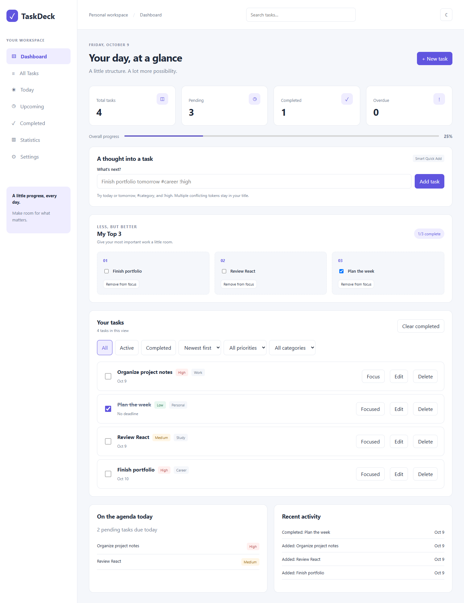

# TaskDeck - Personal Task & Productivity Manager

A React and TypeScript productivity application for organizing tasks, managing deadlines, tracking progress, and staying focused on daily priorities.

TaskDeck combines a simple task management interface with filtering, progress statistics, and a daily focus system. Everything lives in your browser; there is no backend, account, or AI service.

## Screenshots



[Mobile layout](docs/taskdeck-mobile.png) | [Dark theme](docs/taskdeck-dark.png)

Screenshots use tasks created in an isolated browser test. A fresh installation starts empty and all statistics come from your own tasks.

## Features

**Task management**

- Create, edit, complete, reopen, and delete tasks.
- Add descriptions, low/medium/high priorities, custom categories, and optional due dates.
- Undo the most recent deletion and confirm before clearing completed tasks.
- Validate titles, trim whitespace, and report save errors.
- Preserve creation, update, and completion timestamps.

**Search and organization**

- Search titles and descriptions while filtering by status, priority, and category.
- Sort by newest, oldest, priority, or deadline; undated tasks sort last by deadline.
- Navigate between Dashboard, All Tasks, Today, Upcoming, Completed, Statistics, and Settings.
- Today shows unfinished tasks due today; Upcoming shows unfinished tasks with future deadlines.
- Highlight overdue unfinished tasks using local calendar dates.

**Productivity**

- Calculate total, pending, completed, overdue, and completion percentage from saved tasks.
- Choose My Top 3 daily priorities, remove selections without deleting tasks, and see daily completion progress.
- Persist focus selections by local date, enforce the three-task limit, and refresh the date while the app stays open.
- Preview Smart Quick Add commands, such as `Finish portfolio tomorrow #career !high`.
- Recognize `today`, `tomorrow`, `#category`, and `!low`, `!medium`, or `!high` as standalone tokens. Conflicting or unsupported tokens remain in the title.
- Show Monday-to-Sunday completion charts, pending/completed balance, daily completion history, today's agenda, and recent task updates.

**Experience and data**

- Persistent light/dark mode and responsive desktop, tablet, and mobile layouts.
- Collapsible mobile navigation, labeled controls, visible keyboard focus, native modal focus handling, Escape dismissal, and a skip link.
- Browser localStorage persistence with validation and visible errors for malformed or unavailable storage.
- Export versioned JSON backups containing tasks and daily focus selections.
- Import versioned backups or plain task arrays after validation and replacement confirmation.
- Reject duplicate IDs, invalid fields/dates, unsupported versions, more than 10,000 imported tasks, and files larger than 5 MB.

## Tech stack

| Area                       | Technology                           |
| -------------------------- | ------------------------------------ |
| Frontend                   | React 19, strict TypeScript          |
| Build tool                 | Vite                                 |
| Styling                    | CSS with light/dark variables        |
| State management           | React hooks                          |
| Data storage               | Browser localStorage                 |
| Unit/component testing     | Vitest, React Testing Library, jsdom |
| Production browser testing | Playwright with installed Chrome     |
| Code quality               | ESLint, TypeScript, Prettier         |

## Getting started

Use Node.js 22.12 or newer. The app was verified using Node.js 22.13.1 and npm 10.9.2.

```bash
git clone https://github.com/bhavikmithaiwala/react-todo-app.git
cd react-todo-app
npm ci
npm run dev
```

Open the local address shown in the terminal, usually `http://localhost:5173`.

## Development commands

```bash
npm run dev             # Development server
npm run lint            # ESLint
npm run test -- --run   # Unit and component tests, once
npm run test            # Tests in watch mode
npm run build           # TypeScript check and production build
npm run preview         # Preview dist/ locally
npm run test:browser    # Production Chrome smoke test; build first
npm run format          # Format supported project files
npm run format:check    # Check formatting
```

`npm run test:browser` requires Google Chrome installed, starts its own production preview on port 4173, and closes the browser and server when finished. It checks CRUD, refresh persistence, Top 3, navigation, themes, export, import cancellation, modal keyboard behavior, runtime errors, and horizontal overflow at 390/768/1440 pixels. It regenerates the screenshots in `docs/` with sample tasks in an isolated browser profile.

## Project structure

```text
src/
  components/
    common/       # Confirmation, notifications, settings
    dashboard/    # Stats, focus, analytics, recent activity
    layout/       # Sidebar and responsive navigation
    tasks/        # Forms, editor, list, filters, Quick Add
  hooks/          # Saved theme and local-day rollover
  services/       # Validated storage, focus, backup serialization
  test/           # Test setup and fixtures
  types/          # Task and navigation models
  utils/          # Calendar dates, filtering, parsing, analytics
  App.tsx         # Shared task state and screen composition
  App.test.tsx    # End-to-end component interactions
  main.tsx
scripts/smoke.mjs  # Production Chrome verification
docs/             # Screenshots and development commit record
```

## Data behavior and limitations

Tasks belong to this browser profile and website origin. Clearing browser data removes them; export a backup before switching devices or clearing storage. Import replaces the current collection after confirmation. A failed save leaves the current task state in memory and displays an error; export before closing the tab.

Malformed stored task data is left untouched on initial load. Creating tasks or restoring a backup subsequently saves a new collection. Focus from yesterday is not reused today. Removing a focused task does not remove the underlying task.

Completion history reflects retained tasks and their latest completion timestamps. Reopening a task removes its completion timestamp; explicitly deleting tasks or clearing completed tasks removes their statistical records. Recent activity summarizes each task's latest change, rather than maintaining a separate audit log. This version does not synchronize concurrent browser tabs or devices.

## Deployment

Run `npm run build` and publish `dist/` on a static web host. No environment variables or API keys are needed.

For Netlify, import this GitHub repository and deploy `main`; `netlify.toml` configures `npm run build`, `dist`, and Node 22. For Vercel, import the repository, select Vite, and use the same build command and output directory. For a host that serves the app under a subdirectory, configure Vite's `base` to that path before building. Do not use the development server as a production host.

The repository includes GitHub Actions checks for lint, formatting, unit/component tests, and production build. Deployment itself requires connecting your hosting account.

## Development history

Features were implemented incrementally on top of the existing repository. See [the commit record](docs/COMMITS.md). Published commits retain their original history. At the owner's request, finalization commits use June 2025 reference author dates; their committer dates record the current implementation session.

## Future improvements

- Recurring tasks and drag-and-drop ordering.
- Cross-tab synchronization and optional device synchronization.
- An optional Node.js backend and database as a separate release.
- Richer keyboard shortcuts and additional accessibility audits.
